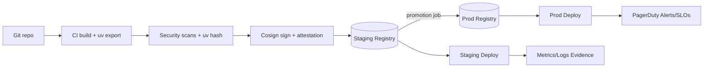

# Deployment Architecture Plan

## Objective & Scope
Translate the refreshed deployment requirements into an actionable architecture that governs uv-based runtime supervision, deterministic configuration sourcing, reproducible artifact packaging, and tightly gated promotion flows across dev, staging, and production. The plan consumes `output/34/deployment_requirements.md`, Feature 1/2 artifacts, and the regenerated router/adapter code to ensure the Telegram relay can be deployed end-to-end with measurable SLOs.

## Layered System Overview
- **Artifact of record**: An immutable OCI image (or VM tarball) that embeds `uv`, `.python-version`, `uv.lock`, the Telegram router/adapter code, and launcher shims (e.g., `ops/uv_start.sh`). The image digest plus `uv lock` checksum function as the promotion fingerprint.
- **Runtime contract**: Every entrypoint runs `uv run bots/telegram_router.py --check-config` before long polling, emits structured JSON logs, exposes `/healthz` only after Telegram and A2A reachability succeed, and honors SIGTERM with a 30s drain to flush queues.
- **Supervision fabric**: Local dev relies on `uv run`; staging/production require supervisors (systemd/runit/Procfile/Kubernetes Deployment) that enforce restart budgets, annotate logs with env/build metadata, and propagate OTEL + metrics exporters defined in the requirements.

## Environment Blueprints
| Environment | Artifact Source & Packaging | Process Supervision | Config & Secret Delivery | Observability & Scaling |
| --- | --- | --- | --- | --- |
| **Local / Dev** | Engineers run `uv sync --locked`; optional `uv export` caches wheels for faster cold starts. | Direct `uv run bots/telegram_router.py --env-file .env` via developer shell or helper target, mirroring lockfile behavior. | `.env` cloned from repo plus sandbox BotFather tokens. Secrets never leave workstation; persona map snapshots hashed for audit. | Console JSON logs only, optional stdout metrics. Single instance fixed at queue depth 25; no autoscaling. |
| **Staging** | CI builds Containerfile using `uv export --format requirements.txt`, installs deps offline, captures image digest and `uv hash`. Pushes to staging registry. | Systemd unit, runit service, or Procfile dyno executes `uv run ... --env-file /run/secrets/.env.runtime`. Supervisor restarts with capped back-off and publishes heartbeats. | CI templates `.env.runtime` from staging vault, stores SHA-256 + ticket ID, mounts via tmpfs, and records config diff vs prod (excluding values). | Logs shipped to staging log drain (14d), OTEL tracing at 25%, Prometheus/StatsD sidecar scrapes metrics. Single active poller; second instance optional passive health sentinel. |
| **Production** | Promotion job reuses staging digest; cosign verifies signature, `uv hash` reruns, and provenance ties to git SHA. Image pulled into prod registry only via promotion workflow. | Kubernetes Deployment (2 replicas: active poller + passive standby) or HA VM pair managed by supervisor. Readiness hits `/healthz`; PreStop waits 30s; passive node switches to active via feature flag in config manifest. | Secrets and persona maps injected from managed vault (AWS SM/GCP SM) using workload identity. Config manifest proves hashed persona map, chat ID, and `ROUTER_VERSION` parity; drift >5% blocks rollout. | Logs stream to SIEM (90d), fatal OTEL spans sampled 100%, Prometheus metrics drive PagerDuty alerts. Autoscaler honors queue depth + latency guardrails and throttles rate limits before scaling out.

## Process Supervision Blueprint
1. **Lifecycle gates**: `/healthz` responds 200 only after ConfigGuard success plus Telegram + A2A handshake. Supervisors and load balancers route traffic strictly based on this probe.
2. **Drain choreography**: Systemd `ExecStop`, Procfile `release`, or Kubernetes `preStop` issues SIGTERM, cancels long poll, and allows up to 30 seconds for queue drain and telemetry flush (guaranteed by `router.uptime_seconds`).
3. **Crash containment**: Restart bursts limited to 5 attempts/15 minutes. Supervisors emit structured events (`router.restart`, `router.uptime_seconds`) and escalate to PagerDuty if thrash occurs.
4. **Capacity guardrails**: Default request 500m CPU/512 MiB. Autoscaler may push to 1 vCPU/1 GiB once `queue.wait_ms` or `latency.round_trip_ms` alarms fire four consecutive intervals. Additional pollers require documented Telegram chat sharding and deterministic offset management captured in the config manifest.
5. **Back-pressure controls**: When CPU >60% or P95 latency >12s, orchestration first tightens `TELEGRAM_RATE_CAPACITY`, `TELEGRAM_QUEUE_SIZE`, or persona caps before adding compute, aligning with Telegram policy and requirements Section 3.1.

## Artifact Packaging & Supply Chain Controls
1. **Build pipeline**
   - Validate `uv lock --frozen`, run lint/tests, and generate requirements via `uv export`.
   - Containerfile installs uv + dependencies into a slim base, copies repo, `.python-version`, telemetry schemas, and CLI shims (e.g., `ops/uv_start.sh`).
   - Produce OCI image digest, `uv.lock` checksum, and attach metadata (git SHA, build ID).
2. **Security automation**
   - Execute SCA on `uv.lock`, run container vulnerability scans (Trivy/Grype), and verify `uv hash` to detect tampering.
   - Sign artifacts with cosign + SLSA attestation tied to the git SHA; publish provenance to registry and deployment logbook.
3. **Registry strategy**
   - Dev/staging share staging registry; production registry is write-protected and only updated by promotion workflow.
   - CI enforces digest parity between staging and production; mismatches trigger drift failure.
4. **Runtime bundle**
   - Read-only root filesystem with `/tmp` as the only writeable path for uv caches.
   - Each deploy bundles `config-manifest.yaml` and its checksum to support DR. Cold-standby restoration replays the manifest + signed artifact within 30 minutes per requirements.

## Configuration & Secret Sourcing
1. **Source of truth**: `.env.example` documents all RouterConfig + adapter knobs. Git-hosted manifests describe per-env overrides; vault stores secrets (`TELEGRAM_BOT_TOKEN`, `A2A_API_KEY`, etc.) following rotation cadences (90/180 days) from the requirements.
2. **Templating**: CI merges manifest values with vault outputs using a deterministic engine (ytt/Jinja), renders `/run/secrets/.env.runtime`, records a SHA-256 hash (with secret values redacted), and stores audit entries with deploy ID.
3. **Verification hooks**: `uv run bots/telegram_router.py --check-config` validates persona map hash, chat ID, rate-limit knobs, and `A2A_API_KEY_ISSUED_AT` freshness before the poller starts. Failure stops deployment.
4. **Drift enforcement**: Promotion job compares staging vs production manifests for key presence and hashed values; >5% difference or missing ticket IDs blocks rollout. Config diff artifacts are uploaded to `output/34/deployment_test_report.md`.
5. **Incident workflow**: Suspected leaks trigger secret rotation pipelines, forced `.env.runtime` regeneration, manifest version increment, and redeploy tagged with incident/change IDs.

## Promotion Flow
1. **Dev → Staging**
   - Gates: green `pytest tests/test_telegram_routing.py` and `tests/test_a2a_adapter.py`, lint + type checks, signed config diff vs template, vulnerability scans passing.
   - Execution: Deploy staging image via CI job, run smoke tests hitting Telegram sandbox + mocked A2A, validate `/healthz`, and soak for ≥30 minutes capturing latency/queue metrics.
   - Evidence: Store command transcripts, log excerpts, metrics screenshots, and config diff hash into `output/34/deployment_test_report.md`.
2. **Staging → Production**
   - Additional gates: rerun container scan on final digest, sign config manifest via `CONFIG_MANIFEST_SIGNATURE` (KMS), capture operator approval ID, verify vault versions not exceeding policy (e.g., `A2A_API_KEY` freshness <90 days).
   - Deployment mechanics: GitOps (ArgoCD/Fleet) updates production manifests referencing same digest + secret versions. Kubernetes path performs rolling update (maxUnavailable=1, maxSurge=1); VM path executes blue/green where standby is promoted after `/healthz` success. Passive pod becomes active via manifest flag if failover required.
3. **Post-deploy + rollback**
   - Monitoring: Enforce SLO targets (P95 latency <12s, fatal adapter failures <3/5m, unauthorized chats zero per day). Alerts page on-call when breached.
   - Rollback: GitOps revert to prior manifest/digest pair or redeploy previous artifact stored in registry. Config manifest ensures identical env knobs, preserving Telegram single-poller guarantee.

## Observability & Audit Architecture
- **Logging**: Supervisors ship JSON logs to environment sinks (dev console, staging log drain 14d, prod SIEM 90d) preserving required fields (`event`, `correlation_id`, `persona_tag`, `chat_id_hash`, `status`, `latency_ms`, `env`, `build_sha`).
- **Metrics**: Prometheus/StatsD expose `latency.round_trip_ms`, `queue.depth`, `a2a.failure_total`, `router.uptime_seconds`, `rate_limit.hit`, and derived SLOs. Dashboards annotate deploys with config manifest + git SHA.
- **Tracing**: OTEL exporters toggle via `OTEL_EXPORTER_OTLP_ENDPOINT`. Staging samples at 25%; production records 100% of fatal spans to feed incident timelines.
- **Audit trail**: Deployment job logs capture artifact digest, `uv lock` checksum, config manifest checksum, operator ID, approval ID, vault versions, and promotion timestamp. Entries plus hashed persona map snapshots satisfy traceability + DR needs.

## Security & Compliance Controls
- Enforce least-privilege networking (egress only to `api.telegram.org` and `A2A_BASE_URL`), run containers as non-root, drop `CAP_NET_RAW`, and mount root FS read-only except `/tmp`.
- Block deployments on critical CVEs found in `uv.lock` or base image; nightly rescans ensure drift-free security posture.
- Automate secret rotation cadence (90-day Telegram tokens, 180-day A2A keys, etc.) with CI checks that fail stale versions.
- Maintain cold standby restoration procedure: replay last signed config manifest + OCI digest within 30 minutes, validated quarterly with evidence stored in audit log.
- Treat documentation as code—this architecture, manifests, runbooks, and deployment test artifacts live in repo for review, compliance, and onboarding continuity.
