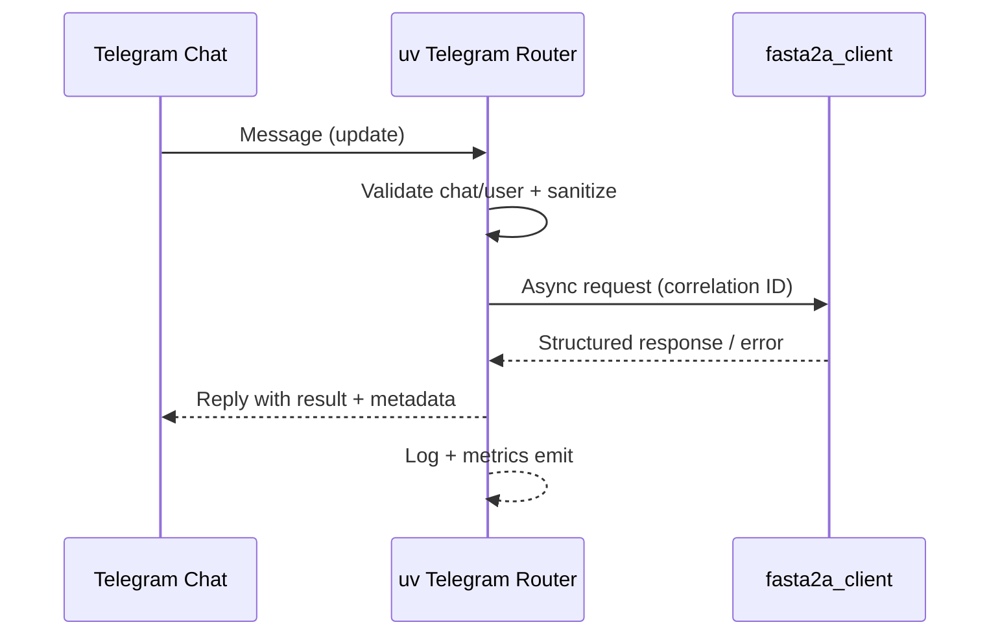

# Feature 1 — Telegram Routing Architecture

## 1. Architectural Overview
- **Objective:** Route authorized Telegram chat messages through the uv-managed Python bot to the upstream `fasta2a_client.py`, then return responses to the originating chat with strict authorization and observability guarantees.
- **Execution Context:** Service starts via `uv run bots/telegram_router.py`, which initializes an `asyncio` event loop (uv bundles Python + deps) and supervises all async tasks.
- **Key Components:**
  1. **Startup & Configuration Guard** — loads/validates `TELEGRAM_BOT_TOKEN`, `TELEGRAM_CHAT_ID`, optional rate-limit + retry knobs; fails-fast with structured errors if invalid.
  2. **Telegram Transport Task** — maintains long-polling connection to Telegram `getUpdates` API, pushes sanitized updates onto an internal queue with correlation IDs.
  3. **Message Router Task** — enforces authorization, performs validation pipeline, and orchestrates the call chain to the A2A adapter.
  4. **A2A Client Bridge** — async wrapper around `fasta2a_client.py` that executes prompts and returns structured responses + metadata.
  5. **Reply Dispatcher** — formats success/error payloads and posts replies to the same Telegram chat, honoring Markdown escaping and chunking rules.

## 2. uv Event Loop Structure
| Stage | Responsibility | Concurrency Notes |
| --- | --- | --- |
| `main()` | Bootstraps env, logging, graceful shutdown hooks | Runs synchronously until loop starts |
| `poll_updates_task` | Performs Telegram long-polling with backoff, pushes `TelegramUpdate` objects into `asyncio.Queue` | Runs forever; restarts on HTTP 5xx/timeout |
| `router_task` | Consumes queue, filters by `TELEGRAM_CHAT_ID`, normalizes text, and fans out to processing coroutines | Uses bounded semaphore to cap concurrent A2A calls |
| `a2a_call_task` | Wraps `fasta2a_client.py` call within `asyncio.to_thread` (if sync) or direct await (if async) | Emits latency metrics + retries based on policy |
| `reply_task` | Sends formatted Telegram replies, splits >4096 chars, attaches correlation ID | Retries send failures with exponential backoff |

**Control Flow:**
1. `uv run` starts `asyncio` loop.
2. `poll_updates_task` awaits `getUpdates(timeout=30, allowed_updates=['message'])` and enqueues updates.
3. `router_task` dequeues, checks chat/user authorization, deduplicates messages via update IDs, and dispatches `a2a_call_task` workers under concurrency limits (default 2).
4. Each worker awaits the A2A response, annotates metadata (duration, status), and hands off to `reply_task`.
5. Structured log + metrics reporters run as background callbacks publishing to stdout/json for ingestion.

## 3. Webhook vs Polling Decision
| Option | Pros | Cons |
| --- | --- | --- |
| **Webhook** | Lowest message latency; Telegram pushes updates instantly; easier horizontal scaling with load balancer | Requires public HTTPS endpoint + certificate; complicates uv deployment; needs ingress + firewall coordination |
| **Long Polling (Chosen)** | Works from private outbound-only environments; no TLS termination needed; resilient to short outages via retry; aligns with single-instance uv CLI deployments | Slightly higher latency (<1s) vs webhooks; single instance handles all traffic |

**Rationale:** Current scope targets a single authorized chat inside constrained infra where opening inbound ports or provisioning TLS certs would add significant lead time. Long polling keeps deployment self-contained while still meeting <2s latency and 99.5% delivery targets. Architecture remains webhook-ready by abstracting the transport layer, enabling later swap without touching router logic.

## 4. Message Validation & Authorization Pipeline
1. **Environment Verification (startup & health):** Ensure `TELEGRAM_BOT_TOKEN` + `TELEGRAM_CHAT_ID` loaded; emit fatal log + exit if missing.
2. **Update Sanity:** Reject non-text updates (stickers, media) with informative reply; log for audit.
3. **Chat Authorization:** Compare `update.message.chat.id` to configured chat ID; if mismatch, log `security.denied` event and optionally send denial message.
4. **User Tagging:** Capture `from.id`, username, display name; attach to log context for traceability.
5. **Content Validation:**
   - Trim whitespace, enforce configurable max length.
   - Strip/escape MarkdownV2 to prevent formatting injection.
   - Reject empty or command-only payloads with usage hint.
   - Optionally parse `/status`, `/retry` commands for operational controls.
6. **Rate & Flood Control:** Apply token-bucket per user/chat to prevent upstream saturation (default 5 requests / 30s, burst 2).
7. **Correlation ID Assignment:** Generate ULID per request, embed in log, Telegram reply, and A2A call metadata.
8. **A2A Request Envelope:** Wrap sanitized text plus correlation ID, persona tag, and timestamp before invoking `fasta2a_client.py`.
9. **Response Validation:** Ensure A2A output conforms to expected schema (text, optional attachments). On schema mismatch, surface fallback error message + log detail.

## 5. Error Handling & Resilience
- **Telegram Transport Faults:** Distinguish client (4xx) vs server (5xx) failures; exponential backoff up to 60s; emit health metric `telegram.transport`.
- **Authorization Violations:** No forwarding occurs; log structured security event with hashed IDs; optional operator alert if repeated.
- **A2A Failures:** Up to 1 retry for transient errors (<2s). On exhaustion, reply with error template containing correlation ID, instructing operator to retry later.
- **Configuration Drift:** Background task periodically re-validates env + network connectivity; on failure toggles a circuit breaker to pause intake while alerting operators.
- **Graceful Shutdown:** Signal handlers drain queues, complete in-flight A2A calls (with timeout), and post "bot paused" message to Telegram.

## 6. Observability & Logging
- **Structured Logging:** JSON logs with fields `{timestamp, level, correlation_id, chat_id, user_id, event, latency_ms, status}`.
- **Metrics Hooks:** Counters for messages processed/denied/error, histograms for A2A latency, gauges for queue depth.
- **Tracing:** Optional OpenTelemetry spans around Telegram fetch + A2A call for distributed tracing compatibility.
- **Audit Trail:** All authorization decisions and A2A outcomes stored via append-only log pipeline (stdout -> collector) to support future Automation Auditor persona.

## 7. Sequence Diagram

This architecture primes the backend developer to implement modular components (transport adapter, router, A2A bridge) with clear contracts, while satisfying the security, latency, and observability requirements captured in Feature 1.
