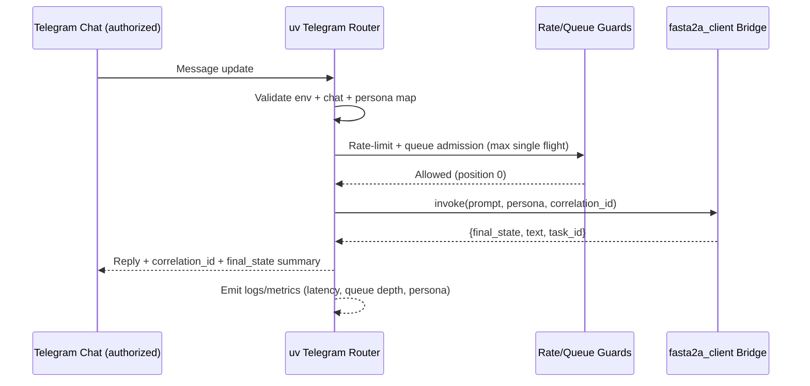
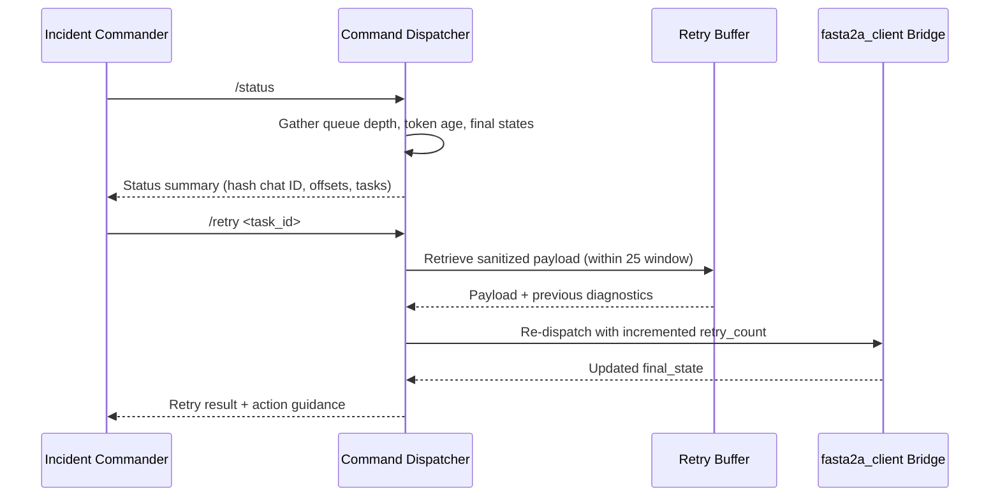

# Feature 1 — Telegram Routing Architecture

## 1. Purpose & Constraints
- **Mission:** Rebuild a uv-managed Telegram router that delivers ≤2 s P50 end-to-end latency, forwards only authorized chat traffic to `fasta2a_client.py`, and surfaces every upstream final state (`completed`, `failed`, `canceled`, `rejected`) back to operators with audit-ready telemetry.
- **Operating Envelope:** Single Telegram chat per environment, outbound-only networking, six prompts/min/user, one in-flight prompt per chat, and strict governance of `TELEGRAM_BOT_TOKEN` and `TELEGRAM_CHAT_ID` as required by the updated requirements dossier.
- **Personas Served:** A2A Operator, On-Call Responder, Incident Commander (priority scheduling + privileged commands), and future Automation Auditor (read-only export expectations drive logging schema).

## 2. Runtime Context (uv + asyncio)
| Layer | Responsibility | Notes |
| --- | --- | --- |
| `uv run bots/telegram_router.py` | Bootstraps virtualized Python runtime, installs dependencies, and ensures identical behavior across laptops, CI, and uv-managed deployments. | uv also exposes `uv pip sync` for deterministic lockfiles. |
| `main()` | Loads env vars, validates token/chat IDs, configures structured logging + OTEL exporters, initializes graceful shutdown hooks, and constructs dependency graph (Telegram client, adapters, health server). | Fails fast with redacted errors if validation misses any requirement gate. |
| `asyncio` tasks | Encapsulate polling, validation, rate limiting, A2A calls, reply dispatch, and health ticks so each concern has isolated telemetry and restart semantics. | Each task registers with uv’s supervisor for crash-loop protection. |

## 3. Component & Task Topology
| Task / Component | Description | Key Policies |
| --- | --- | --- |
| `poll_updates_task` | Executes Telegram `getUpdates` long poll (`timeout=30`, `allowed_updates=['message']`) with cursor tracking and capped exponential backoff. | Drops to safe mode after 3 consecutive 5xx to honor SLA transparency. |
| `ingest_normalizer` | Converts Telegram updates into internal `RouterMessage` objects (id, chat hash, user hash, persona, markdown-safe payload). | Rejects stickers/media, truncates >2 000 chars, stamps ULID correlation IDs. |
| `router_queue` (`asyncio.Queue(maxsize=25)`) | Buffers sanitized prompts so only one hits A2A at a time while preserving ordering and manual replay window. | Immediate busy replies include queue position + correlation ID to keep operators informed. |
| `persona_rate_gate` | Token bucket keyed by `persona+user_id`, permitting 6 prompts/min with burst of 2 and exponential backoff instructions after 3 violations. | Incident Commander persona receives priority dequeuing but still logs every override. |
| `command_dispatcher` | Handles `/status`, `/flush`, `/retry <task_id>`, `/throttle`, `/resume` without hitting A2A, emitting structured audit events containing hashed IDs and delta impacts. | `/status` replies must include token age, queue depth, last Telegram offset, and latest final states. |
| `a2a_adapter_client` | Async façade over `fasta2a_client.py` (temporary direct shim or Feature 2 adapter) executed via `asyncio.to_thread` with semaphore guard (`max_inflight=1`). | Timeout default 12 s; automatically retries once when upstream surfaces retryable status. |
| `reply_dispatcher` | Formats Telegram responses (MarkdownV2 escape, chunk >4 096 chars, append correlation/task IDs) and posts them with jittered retry/backoff. | Guarantees final state echo plus guidance for manual retry/resubmit flows. |
| `health_tick_task` | Runs every 60 s to revalidate env inputs, ensure secrets age <90 d, and optionally emit `/healthz` ping plus metrics on queue depth + latency. | Flips circuit breaker + pinned Telegram alert if config validation fails mid-flight. |

## 4. Data & Control Flow
1. **Startup:** `main()` validates `TELEGRAM_BOT_TOKEN` regex, chat ID bounds, and persona allowlists; configures dependency injection container (Telegram client, adapter shim, logger, metrics, config guards).
2. **Polling:** `poll_updates_task` requests updates with an offset cursor, storing `update_id` on success. Failures differentiate 4xx (configuration/auth) vs 5xx (network/platform) for targeted remediation.
3. **Normalization + Authorization:** `ingest_normalizer` hashes chat/user IDs, enforces chat match against `TELEGRAM_CHAT_ID`, tags persona, and sanitizes payload/content. Unauthorized traffic never enters the queue, satisfying the 100% authorization acceptance metric.
4. **Rate Gate & Queue Insertion:** `persona_rate_gate` decrements per-user tokens. Approved messages enqueue to `router_queue`; rejected ones emit throttle notices and `rate_limit.hit` metrics. Incident Commander prompts may skip to the head of the queue when the busy window exceeds the 10 s P95 requirement.
5. **Dispatch & Single Flight Enforcement:** `a2a_adapter_client` acquires the semaphore, builds the A2A envelope `{prompt, persona, correlation_id, telegram_user_hash, timestamps, retry_count}`, and invokes `fasta2a_client.py`. Queue wait + execution timestamps feed latency histograms.
6. **Final-State Translation:** Responses pass through schema validation, final-state mapping, and optional manual retry cache. Failures mark `retryable` or `terminal` so `/retry` knows whether cached payloads remain eligible.
7. **Reply & Telemetry:** `reply_dispatcher` formats replies, interleaving queue status or manual retry guidance. Logs/metrics/traces capture correlation ID, persona, queue depth, and final state to preserve audit coverage and operator satisfaction metrics.

## 5. Validation, Security & Compliance Gates
- **Token governance:** Maintain `token_loaded_at` timestamp, expose bucketed age via `/status`, and halt startup when metadata suggests unapproved issuer, aligning with 90-day rotation policy.
- **Chat gating:** Compare signed 64-bit `chat.id` to configured env var; log hashed chat ID on every decision. Multi-chat configs stay disabled via guard rails until requirements expand.
- **Payload hygiene:** Enforce text-only ingestion, MarkdownV2 escaping, regex-based secret redaction, and 2 000-character cap before A2A forwarding. Mention truncated context in Telegram replies for transparency.
- **Command audit trail:** Privileged command handlers persist `{command, persona, user_hash, timestamp, effect}` to structured logs and metrics channels, enabling Automation Auditor review.
- **Persona metadata:** Config-driven persona maps (Operator, On-Call, Incident Commander) influence rate buckets, queue priority, and command set; future Automation Auditor persona influences export pipeline but remains non-interactive this release.

## 6. Rate Limiting & Flow Control Blueprint
- **Per-user buckets:** Implement `TokenBucket(capacity=2, refill_rate=6/min)` per user; publish `rate_limit.remaining` gauge for observability.
- **Queue visibility:** Respond with `router busy (position N)` for any enqueued prompt beyond the currently executing job. Include correlation ID so `/status` can cross-reference.
- **Manual retry buffer:** Cache last 25 sanitized prompts/responses keyed by correlation ID + Telegram message ID to satisfy `/retry <task_id>` semantics without persistent storage.
- **Backpressure strategy:** After 3 consecutive queue rejects, broadcast `/throttle` suggestion and escalate to Incident Commander persona for manual intervention.

## 7. A2A Interaction Boundary
- **Adapter contract:**
  - Inputs: sanitized prompt, persona, correlation ID, hashed Telegram identifiers, queue enter/exit timestamps, retry count, optional manual replay reason.
  - Outputs: `{final_state, text, task_id, diagnostics, retryable}` exactly mirroring `fasta2a_client.py final_states` for audit parity.
  - Errors: Distinguish transport vs logical errors; include `retry_after` hints to align with exponential backoff policy.
- **Timeouts & retries:** Default 12 s SLA with 1 retry for transient states flagged by upstream; future adapter will propagate timeout/retry budgets into Feature 2’s dedicated module.
- **Telemetry bridge:** Adapter emits `{latency_ms, final_state, retry_count}` metrics plus correlation IDs so downstream analytics can compute reliability ≥99.5% and queue wait ≤10 s P95.

## 8. Error & Resilience Flows
| Scenario | Detection | Action |
| --- | --- | --- |
| Telegram auth failure (401/403) | `poll_updates_task` response | Pause intake, notify operators via pinned message, require manual token rotation before resuming. |
| Network/5xx while polling | Timeout/HTTP 5xx | Exponential backoff (1 s → 60 s) with jitter; after 5 attempts emit `/status` alert containing failure reason. |
| Unauthorized chat/user | Chat ID mismatch | Send denial response, log `SECURITY_DENIED`, increment counter for compliance reporting. |
| A2A timeout/failure | Adapter raises `RetryableA2AError` or returns `final_state=failed` | One retry respecting semaphore, then send actionable error referencing correlation ID + upstream diagnostics, cache payload for `/retry`. |
| Configuration drift | `health_tick_task` env re-validation | Trigger circuit breaker (stop accepting new prompts), broadcast `/status` alert, exit if unresolved after grace period. |
| Graceful shutdown | SIGINT/SIGTERM | Stop polling, drain queue, await in-flight task ≤12 s, send "bot paused" message, flush logs before uv exit. |

## 9. Observability, Metrics & Compliance Outputs
- **Structured logging:** JSON lines containing `{timestamp, correlation_id, chat_hash, user_hash, persona, event, queue_depth, latency_ms, final_state, command?, retry_count}` guaranteeing final-state transparency and command auditability.
- **Metrics:**
  - Counters: `telegram.messages.processed`, `telegram.security.denied`, `telegram.rate_limit.hit`, `telegram.final_state.{state}`.
  - Histograms: `telegram.round_trip.latency_ms`, `telegram.queue.wait_ms`, `a2a.invoke.latency_ms`.
  - Gauges: `telegram.queue.depth`, `telegram.token.age_days`, `telegram.rate_limit.remaining`.
- **Tracing:** Optional OTEL spans for polling, validation, adapter call, and reply dispatch tie into deployment observability requirements.
- **Health surfaces:** `/status` aggregates queue stats, token age bucket, last Telegram offset, and current `fasta2a_client.py` final states to keep acceptance metrics measurable.

## 10. Sequence Diagrams

### 10.1 Authorized Prompt to Final State

### 10.2 Operator Retry / Status Flow

This architecture grounds the uv long-poll topology, validation and rate-limiting stages, A2A boundary, and resilience flows directly in the refreshed requirements so backend design and implementation teams can proceed with deterministic guidance.
