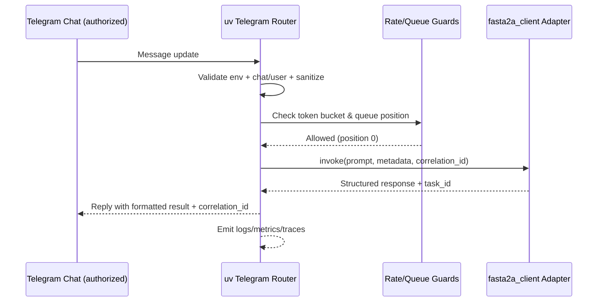
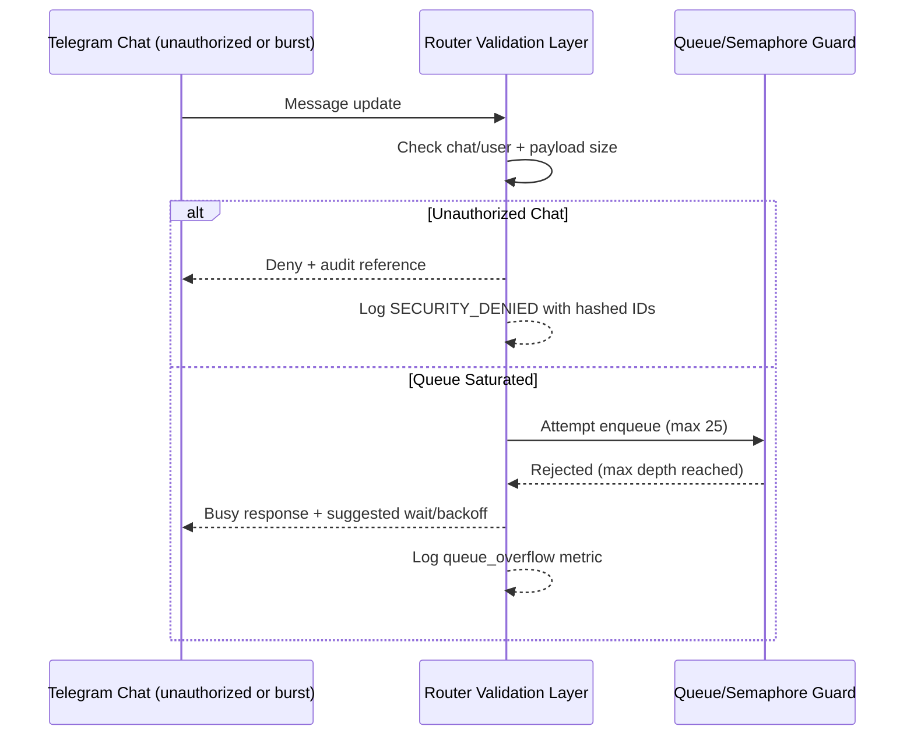

# Feature 1 — Telegram Routing Architecture

## 1. Architectural Overview
- **Objective:** Route authorized Telegram chat messages through a uv-managed Python bot, forward sanitized payloads to the upstream `fasta2a_client.py`, and return responses to the originating chat while preserving strict authorization, auditability, and latency targets.
- **Execution Context:** Operators invoke `uv run bots/telegram_router.py`. uv bundles the Python runtime, installs dependencies, and supervises an `asyncio` loop plus structured logging/metrics exporters so the bot behaves identically across laptops, CI, and deployment hosts.
- **Key Components:**
  1. **Startup & Configuration Guard** — loads/validates `TELEGRAM_BOT_TOKEN`, `TELEGRAM_CHAT_ID`, rate-limit knobs, and retry policies; fails fast with redacted errors if invalid.
  2. **Transport Adapter** — encapsulates the Telegram update mechanism (long polling now, webhook-ready later) and pushes normalized updates onto an internal queue with correlation IDs.
  3. **Routing & Validation Pipeline** — enforces chat/user authorization, sanitizes content, and checks rate-limit/queueing constraints before invoking upstream services.
  4. **A2A Client Bridge** — async façade over `fasta2a_client.py` that carries persona metadata, correlation IDs, and timeout budgets into the upstream workflow.
  5. **Reply Dispatcher** — formats success/error payloads, splits >4096-char replies, and posts results back to Telegram while appending reference metadata.

## 2. uv Event Loop Topology
| Stage | Responsibility | Concurrency Notes |
| --- | --- | --- |
| `main()` | Bootstraps env validation, logging config, health probes, and graceful shutdown hooks | Runs synchronously until loop starts |
| `poll_updates_task` | Maintains Telegram `getUpdates` long-poll with `timeout=30`, limited to `message` updates | Restarted on HTTP 5xx/timeout with capped exponential backoff |
| `router_task` | Consumes normalized updates, verifies chat/user, deduplicates via update and correlation IDs | Runs under bounded queue (default depth 25) to mirror conversation window |
| `persona_rate_gate` | Token-bucket calculator keyed by Telegram user ID + persona | Executes inline; saturates at 6 prompts/min/user |
| `a2a_call_task` | Wraps `fasta2a_client.py` invocation via awaited coroutine or `asyncio.to_thread` | Guarded by semaphore (`max_inflight=1` hard limit for this release) with FIFO wait list |
| `reply_task` | Sends Telegram replies, chunking >4096char and adding MarkdownV2 escaping, correlation IDs, latency stats | Retries failed sends with jittered exponential backoff |
| `health_tick_task` | Periodic env/secret age validation plus `/healthz` heartbeat message (optional) | Can be disabled in dev; surfaces rotation SLAs |

**Control Flow:** `uv run` starts the `asyncio` loop, spawns the tasks above, and centralizes structured logging so each stage emits consistent telemetry. Shutdown signals drain queues, wait for `a2a_call_task` completion (with timeout), notify Telegram that the bot is pausing, and terminate uv cleanly.

## 3. Transport Strategy (Webhook vs Long Polling)
| Option | Pros | Cons |
| --- | --- | --- |
| **Webhook** | Sub-second delivery, Telegram pushes updates instantly, trivial horizontal scaling with a load balancer | Requires public HTTPS endpoint + certificate, introduces ingress/firewall approvals, complicates uv-only deployments |
| **Long Polling (Chosen)** | Works from outbound-only hosts, no TLS termination to manage, easy to run from operator laptops or single-process uv services, resilient to intermittent outages | Slight latency penalty (<1 s) vs webhooks, single instance handles all throughput |

**Decision Drivers:** Requirements target a single authorized chat, outbound-only networking, and rapid recovery. Long polling keeps the deployment self-contained yet still satisfies the ≤2 s P50 latency requirement. The transport layer is abstracted behind the **Transport Adapter**, so migrating to webhooks later only swaps this component without touching validation or A2A logic. Configuration flags (`TELEGRAM_WEBHOOK_URL`, `TELEGRAM_POLL_TIMEOUT`) remain stubbed for future releases.

## 4. Validation & Authorization Pipelines
1. **Environment Verification:** On startup and every `health_tick_task`, verify `TELEGRAM_BOT_TOKEN` matches `^\d+:[A-Za-z0-9_-]{35,}$` and that `TELEGRAM_CHAT_ID` is populated. Fail-fast if missing, and surface a redacted error plus rotation age telemetry.
2. **Update Sanity:** Reject non-text updates (stickers, media, attachments). The router replies with a friendly denial, logs `event=media_rejected`, and records hashed user/chat IDs.
3. **Chat Authorization:** Compare `update.message.chat.id` to the configured `TELEGRAM_CHAT_ID`. Mismatches trigger `SECURITY_DENIED` logs, hashed identifiers, and optional denial replies. No A2A forwarding occurs.
4. **User & Persona Tagging:** Map Telegram user IDs to personas (Operator, On-call, future Auditor) based on allowlists defined in configuration. Persona drives rate-limit buckets and command privileges (`/status`, `/flush`).
5. **Content Validation:**
   - Trim whitespace, collapse newlines, and enforce the 2,000-character cap (pre-forward). Replies include a truncation notice if needed.
   - Escape MarkdownV2 characters, strip HTML, and sanitize secrets via regex denylist before hitting A2A.
   - Parse router commands; commands bypass A2A and hit internal handlers.
6. **Correlation & Traceability:** Generate ULID correlation IDs, attach persona tags, Telegram user hash, and queue position to every structured log, metrics emission, and A2A envelope.

## 5. Rate Limiting, Queueing & Flow Control
- **Per-user token bucket:** 6 prompts/minute/user with burst of 2. Violations increment throttling counters, trigger exponential backoff notices, and emit metrics `rate_limit.hit` to confirm ≤1% throttling target.
- **Single in-flight guard:** `asyncio.Semaphore(1)` ensures only one prompt is processed by A2A at a time, honoring the upstream synchronous polling constraint. Additional prompts remain queued.
- **Queue discipline:** `asyncio.Queue(maxsize=25)` mirrors the conversation history window. When full, the router rejects new prompts with `HTTP 429`-style messaging and instructs operators to wait.
- **Busy notifications:** If a prompt enters the wait queue, the bot replies immediately with `router busy (position N)` including the correlation ID so operators know their request status.
- **Retry/backoff orchestration:** After 3 consecutive throttles or queue drops, the router enforces exponential backoff (base 5 s, cap 60 s) and surfaces a `/help` hint. Operators can issue `/status` to view queue depth and current job metadata.

## 6. External A2A Touchpoints
- **Adapter Boundary:** The router calls an internal adapter module (`services/a2a_adapter.py`, to be delivered in Feature 2) that wraps `fasta2a_client.py`. Until then, the router interacts directly with `fasta2a_client.py` through an awaitable `invoke(prompt, metadata)` shim living under `bots/adapters/a2a_bridge.py`.
- **Invocation Contract:**
  - **Inputs:** `{prompt, persona, correlation_id, telegram_user_id_hash, timestamps}`.
  - **Timeout:** Default 12 s upstream SLA; configurable via `A2A_TIMEOUT_SECONDS`. The adapter enforces retries for transient statuses flagged by the upstream client.
  - **Outputs:** Structured object `{status, text, attachments?, task_id, diagnostics}`. The router validates schema compliance before replying to Telegram.
- **Error Surface:** Fatal adapter errors bubble up as structured exceptions carrying `retryable` metadata so the router can decide between retry, failure message, or operator escalation.
- **Observability Bridge:** Adapter emits latency histograms and success/error counters into the shared telemetry layer so P50/P95 metrics in the requirements remain auditable.

## 7. Error Handling & Resilience
- **Transport Faults:** Distinguish Telegram client (4xx) vs server (5xx) failures. 4xx trigger operator-visible alerts; 5xx cause exponential backoff up to 60 s with jitter.
- **Authorization Violations:** Never forwarded; emit structured security log plus optional `/security` alert when repeated attempts exceed threshold.
- **A2A Failures:** One retry for transient states (network timeout, 5xx). On exhaustion, reply with actionable error template referencing correlation ID and last upstream status.
- **Configuration Drift:** Background `health_tick_task` revalidates env and network connectivity. Failures flip a circuit breaker that pauses queue intake and posts a pinned Telegram status message.
- **Graceful Shutdown:** Signal handlers drain queues, finish in-flight work (respecting timeout), send "bot paused" notice with reason, and exit uv with zero status for process managers.

## 8. Observability & Telemetry
- **Structured Logging:** JSON logs with `{timestamp, level, correlation_id, chat_id_hash, user_id_hash, persona, event, latency_ms, queue_depth, status}` ensuring 100% trace coverage.
- **Metrics:**
  - Counters — messages processed/denied/error, rate-limit hits, busy-queue rejects.
  - Histograms — Telegram → A2A round-trip latency, adapter invocation latency, queue wait duration.
  - Gauges — queue depth, semaphore occupancy, token-bucket remaining capacity.
- **Tracing:** Optional OpenTelemetry spans wrap Telegram fetch + A2A calls, enabling distributed traces once exporters are wired.
- **Audit Trail:** Logs stream to stdout → collector; hashed identifiers satisfy confidentiality while enabling the Automation Auditor persona’s future work.

## 9. Sequence Diagrams

### 9.1 Authorized Prompt (Happy Path)

### 9.2 Unauthorized or Busy Flow

This refreshed architecture codifies the uv topology, transport stance, validation and rate-limit mechanics, plus the upstream A2A integration boundary so downstream design and implementation work can proceed deterministically.
