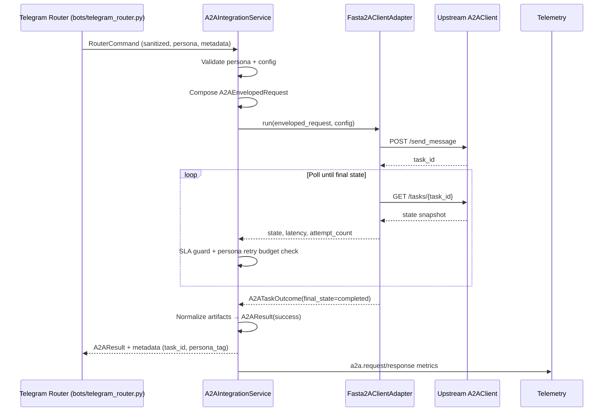
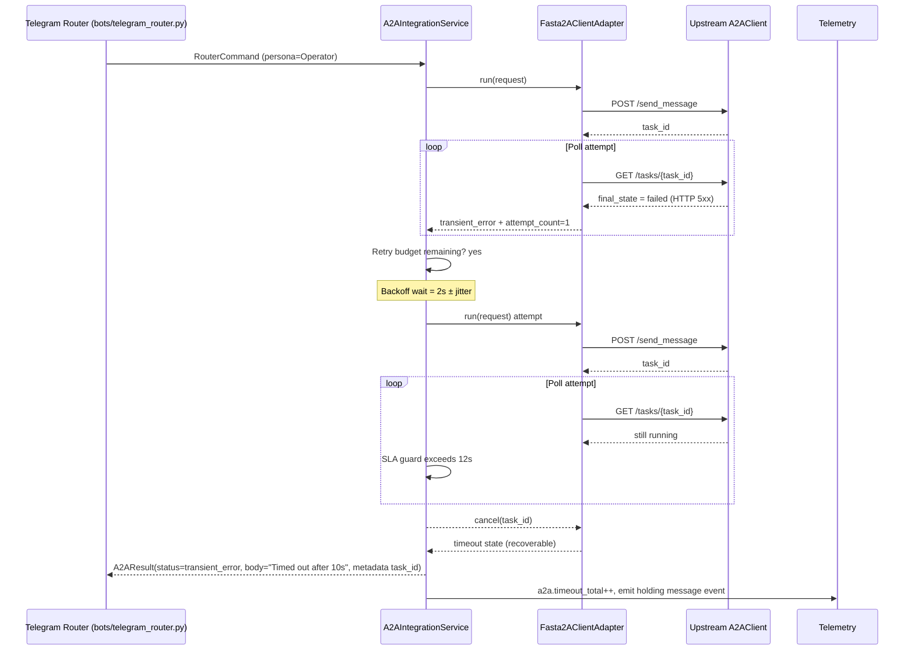
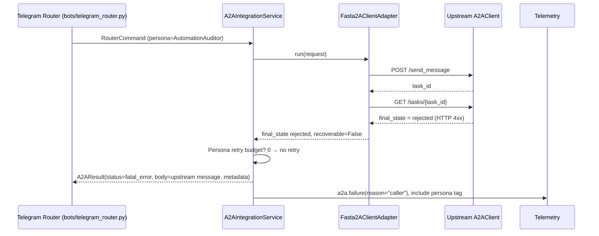

# Feature 2 — A2A Integration Architecture

## 1. Architectural Intent
- **Objective** — Provide a deterministic adapter between `RouterCore` and the upstream `fasta2a_client.py` so that Telegram prompts reach the A2A network with full metadata, strict SLAs, and auditable results.
- **Operating model** — All work runs inside the uv event loop. Blocking sections of `fasta2a_client.py` execute in `asyncio.to_thread` so Router latency budgets (<12s P95) remain intact.
- **Design lens** — API-first contract separating orchestration (`A2AIntegrationService`) from transport (`Fasta2AClientAdapter`) so downstream developers, testers, and ops can replace or simulate each layer independently.

## 2. Service Boundaries & Responsibilities
| Boundary | Responsibilities | Inputs | Outputs |
| --- | --- | --- | --- |
| `RouterCore` | Authorize Telegram traffic, sanitize prompt text, determine persona tags/duty status, and call A2A integration with a `RouterCommand`. | `RouterCommand`, rate-limit + SLA context | `A2AResult` or raised `A2AIntegrationError` |
| `A2AIntegrationService` | Validate persona/configuration, enrich metadata envelope, enforce retries/timeouts, emit telemetry, and normalize upstream responses. | `RouterCommand`, config struct, observability handles | `A2AResult`, structured error events |
| `MetadataComposer` (subcomponent) | Generate `A2AEnvelopedRequest`, compute checksum, merge compliance + telemetry tags. | `RouterCommand`, persona registry | `A2AEnvelopedRequest` |
| `DispatchController` (subcomponent) | Invoke adapter, manage polling state machine, enforce SLA guard. | Enveloped request, timers | `A2ATaskOutcome`, retry signals |
| `Fasta2AClientAdapter` | Wrap `fasta2a_client.py`, inject auth headers, translate envelope to upstream `Message/TextPart`. | `A2AEnvelopedRequest`, env config | `A2ATaskHandle`, `A2ATaskState`, normalized artifacts |
| Upstream `A2AClient` | Execute `send_message` + `get_task` requests against remote agent. | HTTP requests | Task states, artifacts, server metadata |
| Telemetry Sink | Persist `a2a.request/response/failure` logs, counters, and histograms. | Structured log payloads | Metrics dashboards, alerts |

## 3. Interface Contracts

### 3.1 Router → Integration Boundary
```python
class A2AIntegrationService(Protocol):
    async def execute(
        self,
        command: RouterCommand,
        *,
        timeout_override: float | None = None,
    ) -> A2AResult: ...

@dataclass
class RouterCommand:
    correlation_id: str  # ULID `tg-<update_id>`
    chat_id: str
    user: str
    persona_tag: Literal[
        "Operator",
        "OnCall",
        "IncidentCommander",
        "AutomationAuditor",
    ]
    duty_status: Literal["primary", "secondary", "sev1"]
    sanitized_text: str
    received_at: datetime
    telemetry: dict
    compliance_tags: dict
    redaction_rules: list[str]
    queue_depth: int
    semaphore_slots: int
```
`execute()` guarantees idempotency via `correlation_id`, supports persona-aware timeout overrides (IncidentCommander routes pass tighter limits), and returns a normalized `A2AResult` (see §3.4). Errors raise `A2AIntegrationError` with `classification`, `attempt_count`, and `metadata` fields so Router logging/tests can assert deterministic behavior.

### 3.2 Metadata Envelope
`MetadataComposer` enriches the router payload into an `A2AEnvelopedRequest` that satisfies the metadata table from the requirements.

```yaml
A2AEnvelopedRequest:
  correlation_id: string (ULID)
  message_id: uuid4
  chat_id: string
  user: string
  persona_tag: enum[Operator, OnCall, IncidentCommander, AutomationAuditor]
  duty_status: enum[primary, secondary, sev1, audit]
  received_at: datetime
  prompt_checksum: sha256 string
  telemetry:
    source: "telegram_router"
    version: semver
    environment: string
  compliance_tags: object
  persona_context: object
  trace:
    queue_depth: int
    semaphore_slots: int
  redaction_rules: [string]
  sanitized_text: string
  envelope_version: int (default 1)
```

| Field | Source | Notes |
| --- | --- | --- |
| `correlation_id` | Router ULID (`tg-<update_id>`) | Drives idempotency + log joins end-to-end. |
| `message_id` | Generated UUID4 | Satisfies upstream `A2AClient` requirement and audit replay. |
| `persona_tag` | Persona registry | Enforce `A2A_ALLOWED_PROMPT_TAGS`; IncidentCommander adds queue preemption metadata. |
| `persona_context` | Router persona table | Embeds duty status, escalation handles, and hashed Telegram user IDs. |
| `prompt_checksum` | SHA256 of sanitized text | Enables dedupe + confidentiality (no raw text). |
| `telemetry` | Router build info | Mirrors Feature 1 telemetry contract for `/status`. |
| `trace` | Router runtime stats | Captures queue depth + semaphore slots for upstream triage. |
| `redaction_rules` | Sanitizer | Documents already-scrubbed patterns so A2A avoids redundant filtering. |
| `compliance_tags` | Deployment config | Carries region/classification info for upstream guardrails. |

`MetadataComposer` copies `correlation_id`, `message_id`, `persona_tag`, and `prompt_checksum` into both `Message.metadata` and each `TextPart.metadata` block so downstream auditors can prove payload lineage.

### 3.3 Adapter Contract
```python
@dataclass
class A2AConfig:
    base_url: AnyHttpUrl
    api_key: str | None
    poll_interval_s: float = 2.0
    poll_timeout_s: float = 30.0
    retry_limit: int = 1
    retry_backoff_s: float = 2.0
    retry_backoff_multiplier: float = 2.0
    retry_backoff_max_s: float = 8.0
    allowed_persona_tags: set[str]
    api_key_issued_at: datetime | None
    allow_insecure: bool = False

@dataclass
class A2AAdapterRequest:
    envelope: A2AEnvelopedRequest
    config: A2AConfig

class Fasta2AClientAdapter(Protocol):
    async def run(self, request: A2AAdapterRequest) -> A2ATaskOutcome: ...

@dataclass
class A2ATaskOutcome:
    task_id: str
    final_state: Literal["completed", "failed", "canceled", "rejected", "timeout"]
    attempt_count: int
    latency_ms: int
    artifacts: list[str]
    server_messages: list[str]
    upstream_state: dict[str, Any]
```
`Fasta2AClientAdapter` is the only layer aware of the upstream schema. It maps the envelope to:

```python
Message(
    role="user",
    kind="message",
    message_id=envelope.message_id,
    metadata={...},
    parts=[
        TextPart(
            text=envelope.sanitized_text,
            kind="text",
            metadata={
                "correlation_id": envelope.correlation_id,
                "persona_tag": envelope.persona_tag,
                "prompt_checksum": envelope.prompt_checksum,
                # ...
            },
        )
    ],
)
```

Adapter responsibilities:
- Validate `A2A_BASE_URL` as HTTPS unless `allow_insecure` is set for dev, and fail-fast if the API key age >90d as dictated in the requirements.
- Inject `Authorization: Bearer <A2A_API_KEY>` (via upstream `AuthInterceptor`) whenever a key exists; omit entirely otherwise.
- Configure HTTPX client timeouts (≤1s connect/read) and TLS 1.2+ inside `fasta2a_client.py` before issuing `send_message` and `get_task` calls.
- Wrap synchronous upstream functions inside `asyncio.to_thread` so Router latency budgets remain met.
- Surface `A2AAdapterError(recoverable=True|False)` so the integration service can propagate retries/timeouts consistently with persona rules.

Adapter HTTP request/response schema:
- **POST `/send_message`** — Body `{ "message": MessageSchema }`; response `{ "task_id": str }` echoed into `A2ATaskOutcome.task_id`.
- **GET `/tasks/{task_id}`** — Response `{ "state": Literal["in_progress","completed","failed","canceled","rejected"], "attempt_count": int, "artifacts": [TextPart], "messages": [str] }`.
- Adapter normalizes `TextPart` arrays into UTF-8 strings, preserving additional metadata when non-text artifacts arrive (flagging `fatal_error`).

### 3.4 Normalized Response
```yaml
A2AResult:
  status: enum[success, transient_error, fatal_error]
  body: string (UTF-8)
  metadata:
    correlation_id: string
    task_id: string
    final_state: enum[completed, failed, rejected, canceled, timeout]
    attempt_count: int
    upstream_latency_ms: int
    persona_tag: string
    server_messages: [string]
    compliance_tags: object
    telemetry: object
```
Status mapping mirrors the requirements: `completed → success`, `failed/rejected → fatal_error`, `canceled/timeout/transport → transient_error`. Binary or multi-artifact responses are collapsed into text with warnings referencing the quarantine location to preserve confidentiality promises, and metadata always echoes persona/compliance envelopes for audit replay.

## 4. Timeout, Polling, and Persona-Aligned Retry Controls
| Control | Default | Owner | Behavior |
| --- | --- | --- | --- |
| `A2A_POLL_INTERVAL_SECONDS` | 2s ±200ms jitter | DispatchController | Sleep between `get_task` calls; jitter prevents lockstep bursts. |
| `A2A_POLL_TIMEOUT_SECONDS` | 30s | DispatchController | Hard ceiling per attempt; raises `transient_error` when exceeded. |
| `A2A_MAX_POLLS` | Derived (`timeout ÷ interval`) | DispatchController | Guardrail preventing runaway loops even if timeout misconfigured. |
| `A2A_RETRY_LIMIT` | 1 | RetryOrchestrator | Applies to transient failures (timeouts, HTTP 5xx, `canceled`, JSON decode). |
| `A2A_RETRY_BACKOFF_SECONDS` | 2s base, ×2 multiplier, max 8s | RetryOrchestrator | Aligns with Router-level backoff to keep <12s P95 SLA. |
| Telegram SLA Guard | 12s P95 across intake→reply | RouterCore | Cancels in-flight A2A call if cumulative latency threatens SLA; returns holding message w/ task ID. |
| `A2A_API_KEY_ISSUED_AT` | ISO timestamp | ConfigRegistry | Startup validation fails if key age >90d to honor rotation policy. |

Persona rules drive how those controls propagate downstream:

| Persona | Auto Retry Budget | Timeout Handling | Notes |
| --- | --- | --- | --- |
| Operator | 1 automatic retry (transient only); unlimited manual `/retry` while queue depth ≤3 | Uses default poll interval + SLA guard; background poll continues up to 12s total | Default persona for most traffic. |
| OnCall | 1 automatic retry when queue depth <2 | Shares Operator timeout but caps total attempts (auto + manual) at 2 | Prevents after-hours overload. |
| IncidentCommander | 0 automatic retries; manual `/retry <task_id>` allowed after explicit confirmation | `timeout_override` tightened to ≤2s P95 and queue preemption invoked | Ensures Sev-1 commands do not stall queues. |
| AutomationAuditor | 0 retries (auto or manual) | SLA guard still 12s but early abort when waiting on upstream >4s to protect compliance budgets | Read-only persona; responds with compliance warnings when retries requested. |

Timers live inside the integration service so downstream code simply awaits `execute()`. The SLA guard uses monotonic timers to abort polling early and instructs the adapter to cancel outstanding tasks while returning holding responses with task IDs so operators can monitor background completion.

## 5. Error Propagation & Signaling
| Source Event | Detection Point | Classification | Router Action | Telemetry |
| --- | --- | --- | --- | --- |
| `httpx.ConnectError`, TLS failures | Adapter send/poll | `transient_error` | Retry within limit; final response instructs operator to re-issue. | `a2a.failure` (`reason=transport`) + counter increment |
| HTTP 5xx / JSON decode issues | Adapter poll loop | `transient_error` | Retry once; include upstream status in body metadata. | Emit latency + error counters |
| HTTP 4xx (≠429) or upstream `failed/rejected` | Adapter final state | `fatal_error` | No retry; respond with upstream message + persona guidance. | `a2a.failure` (`reason=caller`) |
| 429 with optional `Retry-After` | Adapter poll | `transient_error` | Sleep indicated value (bounded by SLA) before final retry. | `a2a.retry_total` + histogram bucket |
| `canceled` state mid-poll | Adapter | `transient_error` | Retry if SLA headroom remains, else respond with cancellation note. | Cancellation metric |
| SLA timeout (Router guard) | DispatchController | `transient_error` | Send holding reply, continue background poll up to 12s total, then emit `timeout`. | `a2a.timeout_total` |
| Unexpected artifact type | Normalizer | `fatal_error` (masked payload) | Return warning referencing quarantine pointer. | `a2a.failure` (`reason=artifact`) |

All failures raise `A2AIntegrationError` with fields `{classification, task_id?, correlation_id, attempt_count, upstream_state}` so Router logging and tests can assert behavior deterministically.

## 6. Sequence Views

### 6.1 Successful Invocation


### 6.2 Retry then Timeout Propagation


### 6.3 Fatal Error Without Retry


## 7. Security, Configuration, and Observability Anchors
- **Configuration validation** — Startup uses `ConfigRegistry` to ensure `A2A_BASE_URL` is HTTPS (unless `ENV=dev`), optional `A2A_API_KEY` age <90d, and persona allowlist matches `A2A_ALLOWED_PROMPT_TAGS`. Fail fast with structured `config.error` log when requirements are unmet.
- **Auth & transport hardening** — The adapter loads secrets from memory only, registers the upstream `AuthInterceptor`, and enforces TLS 1.2+. Non-TLS origins trigger `reduced_trust` mode logs unless explicitly allowed via `A2A_ALLOW_INSECURE=true` in local dev.
- **Metadata hygiene** — Cleartext usernames are passed upstream but hashed in logs. Prompt text is never persisted; only the SHA256 checksum plus metadata envelopes reach storage.
- **Observability** — Emit counters (`a2a_success_total`, `a2a_transient_error_total`, `a2a_fatal_error_total`, `a2a_retry_total`) and histograms (`a2a_latency_ms`). Telegram `/status` command surfaces latest latency percentiles plus persona-sliced metrics.
- **Extensibility** — Componentized boundaries make it straightforward to plug alternate clients (REST, gRPC) or additional persona tags without touching Router transport logic. The architecture also enables integration tests to mock `Fasta2AClientAdapter` and assert retry/error branches.

This architecture document is the authoritative input for the downstream design and implementation stages of Feature 2.
