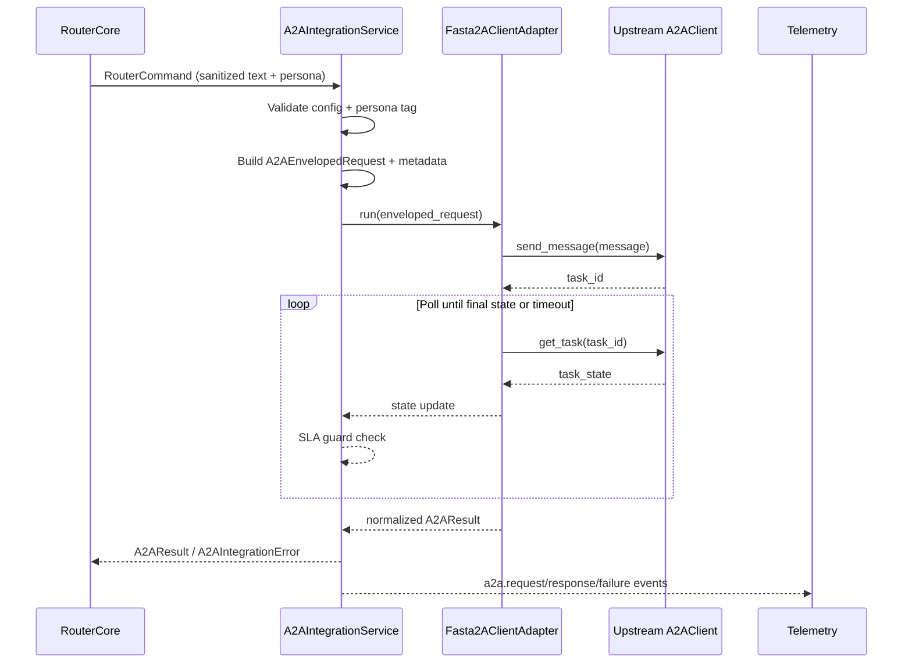

# Feature 2 — A2A Integration Architecture

## 1. Architectural Intent
- **Goal:** Extend the Telegram router with a deterministic adapter that invokes the upstream `fasta2a_client.py` (A2A network) using rich metadata, strict timeout controls, and auditable responses.
- **Constraints:** Router operates inside a uv-managed single-process deployment with outbound-only egress. All calls must remain non-blocking to preserve <12s P95 Telegram round-trip latency.
- **Approach:** Encapsulate the upstream client behind an `A2AIntegrationService` boundary that accepts sanitized `RouterCommand` payloads, enriches them with the required metadata envelope, orchestrates polling + retries, and returns normalized `A2AResult` objects.

## 2. Service Boundaries & Responsibilities
| Boundary | Responsibilities | Inputs | Outputs |
| --- | --- | --- | --- |
| `RouterCore` (existing) | Authorize Telegram traffic, sanitize prompt text, derive persona tags, and hand off requests to A2A service along with `correlation_id`. | `RouterCommand` | `A2AResult` or raised `A2AIntegrationError` |
| `A2AIntegrationService` (new orchestrator) | Enforce persona & configuration validation, transform request into upstream schema, drive polling loop, enforce timeout SLA, emit metrics/logs. | `RouterCommand`, env config, observability handles | `A2AResult` (success/transient/fatal) |
| `Fasta2AClientAdapter` (wrapper around `fasta2a_client.py`) | Translate high-level message envelope into `A2AClient` calls, abstract sync/async boundary via `asyncio.to_thread`, surface structured errors. | `A2AEnvelopedRequest` | `A2ATaskHandle`, `A2ATaskState` |
| Upstream `A2AClient` | Execute task lifecycle (send message, poll task) against external service. | Message payload, base URL, optional API key | Task status objects, artifacts |
| Telemetry Sink | Collect structured logs/metrics for SLA tracking. | Enriched telemetry events | Stored traces, counters |

## 3. Interface Contracts

### 3.1 Request Envelope (`A2AEnvelopedRequest`)
```yaml
A2AEnvelopedRequest:
  correlation_id: string (ULID `tg-<update_id>`)
  message_id: uuid
  chat_id: string
  user: string (cleartext for upstream, hashed surrogate used in logs)
  persona_tag: enum[Operator, OnCall, AutomationAuditor]
  received_at: datetime (ISO-8601)
  prompt_checksum: string (sha256)
  telemetry:
    source: "telegram_router"
    version: semver
    environment: string
  compliance_tags: object
  persona_context: object
  redaction_rules: [string]
  trace:
    queue_depth: int
    semaphore_slots: int
  sanitized_text: string (Markdown stripped)
```

`A2AIntegrationService` produces this schema before invoking `Fasta2AClientAdapter.run(enveloped_request)`.

### 3.2 Upstream Message Mapping
```python
message = Message(
    role="user",
    kind="message",
    message_id=request.message_id,
    parts=[
        TextPart(
            text=request.sanitized_text,
            kind="text",
            metadata={
                "correlation_id": request.correlation_id,
                "persona_tag": request.persona_tag,
                "prompt_checksum": request.prompt_checksum,
                "chat_id": request.chat_id,
                "user": request.user,
                "received_at": request.received_at,
                "telemetry": request.telemetry,
                "compliance_tags": request.compliance_tags,
                "redaction_rules": request.redaction_rules,
                "trace": request.trace,
            },
        )
    ],
    metadata={
        "persona_context": request.persona_context,
        "persona_tag": request.persona_tag,
        "correlation_id": request.correlation_id,
    },
)
```

### 3.3 Normalized Response (`A2AResult`)
```yaml
A2AResult:
  status: enum[success, transient_error, fatal_error]
  body: string (UTF-8)
  metadata:
    task_id: string
    final_state: enum[completed, failed, canceled, rejected, timeout]
    attempt_count: int
    upstream_latency_ms: int
    persona_tag: string
    server_messages: [string]
    correlation_id: string
```
`Fasta2AClientAdapter` ensures artifacts >1 text result are concatenated with double newline separators; unexpected binary artifacts trigger quarantine + warning note referencing storage pointer.

## 4. Timeout, Polling, and Retry Strategy
| Control | Default | Behavior |
| --- | --- | --- |
| `A2A_POLL_INTERVAL_SECONDS` | 2s | `A2AIntegrationService` awaits between `get_task` calls; jitter ±200ms to avoid synchronized bursts. |
| `A2A_POLL_TIMEOUT_SECONDS` | 30s | Hard ceiling per attempt; hitting this surfaces `transient_error` with hint to retry. |
| `A2A_MAX_POLLS` | Derived (`timeout / interval`) | Prevents infinite loops; if limit reached first, treat as timeout. |
| `A2A_RETRY_LIMIT` | 1 | Applies only to transient classifications (timeouts, HTTP 5xx, canceled state, decoding issues). |
| `A2A_RETRY_BACKOFF_SECONDS` | 2s base, *2 multiplier, capped at 8s | Shared with RouterCore so SLA stays under 12s P95. |
| Telegram SLA Guard | 12s P95 | RouterCore aborts call if `wall_clock` exceeds guard even mid-poll, returning informative error to operator. |

`A2AIntegrationService` records `attempt_count` and passes final telemetry (latency, retries) back to RouterCore for metrics.

## 5. Error Propagation Matrix
| Event Source | Detection | Classification | Router Behavior |
| --- | --- | --- | --- |
| HTTP transport failure (`httpx.ConnectError`, TLS) | Exception from `Fasta2AClientAdapter` | `transient_error` | Retry within limit; on exhaustion reply with outage template referencing `correlation_id`. |
| HTTP 5xx / JSON decoding | Response status / parsing error | `transient_error` | Retry once; include upstream status code + hint to reissue later. |
| HTTP 4xx (≠429) or upstream `failed/rejected` | Response payload final state | `fatal_error` | No retry. Include upstream message + persona guidance. |
| 429 rate limit | Status code or `Retry-After` header | `transient_error` | Sleep `Retry-After` if provided, else `A2A_RETRY_BACKOFF_SECONDS`, then final retry. |
| `canceled` state | Poll response | `transient_error` | Retry once (if within SLA) else respond with cancellation notice. |
| Unexpected artifact media | Artifact inspection | `fatal_error` but mask payload | Log + quarantine pointer, instruct operator to escalate. |
| Timeout reached | `poll_elapsed >= timeout` or Router SLA guard | `transient_error` | Provide message "Timed out after <n>s (correlation <id>)". |

All errors raise `A2AIntegrationError` with structured fields so RouterCore logging remains consistent.

## 6. Configuration & Security Considerations
- Configuration loader validates required env vars (`A2A_BASE_URL`) during startup and optionally `A2A_API_KEY`. Missing required entries cause boot failure with structured `config.error` log.
- `A2A_API_KEY` (when set) is injected via the upstream client's `AuthInterceptor` to add an `Authorization: Bearer` header; secrets never appear in logs or Telegram replies.
- Persona validation ensures `persona_tag ∈ A2A_ALLOWED_PROMPT_TAGS`; router rejects unsupported tags before dispatch.
- Observability hooks emit `a2a.request`, `a2a.response`, `a2a.failure` events with correlation ID, persona, attempt count, and latency buckets.

## 7. Sequence Flows


## 8. Developer Handoff Notes
- `A2AIntegrationService` should expose an async API (`async def execute(command: RouterCommand) -> A2AResult`) so RouterCore awaits it directly.
- Ensure the adapter is injectable/mocks for tests to trigger transient/fatal paths defined above.
- Provide OpenAPI-like documentation for downstream consumers if additional services integrate with the A2A adapter in the future.
