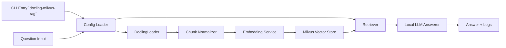
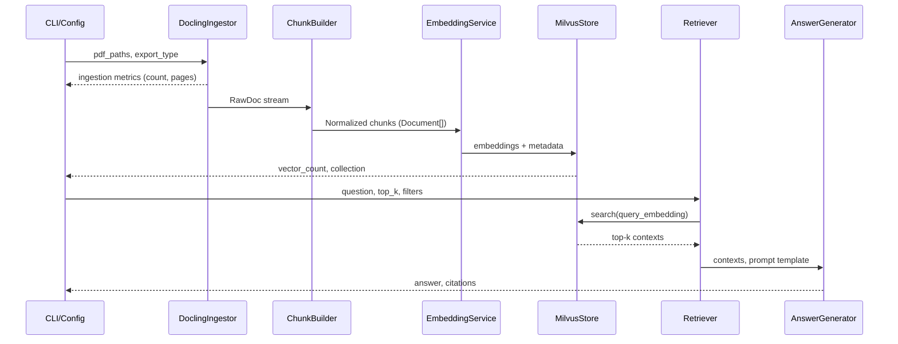

# Docling→Milvus RAG Architecture

## Goals & Constraints
- Execute the entire Docling ingestion → chunking → embedding → Milvus → LLM answering loop locally via `uv run docling-milvus-rag`.
- Avoid HuggingFace tokens or hosted inference; rely on locally runnable and cacheable models only.
- Keep the project minimal yet modular so downstream agents can implement CLI packaging, backend modules, and tests independently.
- Provide reproducible defaults (dummy PDF, Milvus file-URI, baseline embedding/LLM models) while allowing overrides via CLI/config.

## High-Level Dataflow

1. CLI parses arguments (PDF path, question, Milvus URI, export type, embedding/LLM choices, retrieval params).
2. Config loader merges CLI args with defaults stored in `config.yaml`/`pyproject` entry constants.
3. Docling ingestion reads local PDF(s) and exports structured documents.
4. Chunk normalizer harmonizes metadata + text, generating LangChain `Document` objects sized for embedding.
5. Embedding service transforms chunks into vectors using a token-free local model.
6. Milvus vector store persists embeddings and exposes retrieval to the QA stage.
7. Retriever fetches top-k chunks and hands them—with metadata—to the local LLM answerer.
8. LLM composes the final response and logs summary metrics.

## Component Contracts & Dependency Decisions
| Layer | Component & Contract | Key Dependencies | Defaults & Notes |
| --- | --- | --- | --- |
| Ingestion | `DoclingIngestor` accepts `Iterable[Path]` and yields `Iterable[RawDoc]` with `text`, `metadata.source`, `metadata.page`. | `docling`, `docling-parse`, `pypdf` (transitive). | Export type default `ExportType.DOC_CHUNKS`; fallback `ExportType.MARKDOWN` for debugging. |
| Normalization | `ChunkBuilder` consumes `RawDoc` and emits LangChain `Document` objects sized to ~600 tokens with 100-token overlap. | `langchain-text-splitters`. | Overlap + chunk size derived from CLI flags `--chunk-size`, `--chunk-overlap`. |
| Embedding | `EmbeddingService.embed(documents)` returns `(embeddings, metadata)` arrays. | `sentence-transformers`, `langchain-huggingface`. | Default model `sentence-transformers/all-MiniLM-L6-v2`; `UV` pre-download via `uv pip install --extra-index-url https://huggingface.co`. No token required; optionally allow `--embedding-model` override. |
| Vector Store | `MilvusStore` encapsulates collection initialization, insert, and retrieval. Contract: `upsert(embeddings, metadocs)` and `similarity_search(query, top_k)` returns `(Document, score)` pairs. | `pymilvus>=2.4`, `langchain-milvus`. | Default URI `sqlite:///./.milvus/docling.db` using Milvus Lite; CLI flag `--milvus-uri` for override. Auto-create collection `docling_chunks` with dynamic field schema {id UUID, vector float32[384], metadata JSON}. |
| Retrieval | `Retriever.run(question)` uses embeddings query or hybrid (vector + metadata filter). | `langchain`, `langchain-community`. | Default `top_k=4`, filter by `doc_id` from PDF path to keep context local. |
| Answering | `AnswerGenerator.generate(question, contexts)` returns string + trace. | `llama-cpp-python` (with quantized `Phi-3-mini-instruct` or `Mistral-7B-Instruct (GGUF)`), `langchain` LLM wrappers. | Default model path `models/Phi-3-mini-4k-instruct-q4.gguf` bundled via README instructions; CLI `--llm-model` overrides. Temperature default 0.1, max tokens 512. |
| Orchestration | `Pipeline.run(config)` orchestrates sequential phases, handles logging, and surfaces metrics. | `structlog`/`logging`, `pydantic` for config validation. | Standard log fields: `phase`, `duration_ms`, `chunk_count`, `vector_count`, `retrieval_latency`, `generation_latency`. |

## Configuration Defaults & Overrides
- **Config hierarchy:** CLI arguments → environment variables → `config/defaults.toml` (optional) → hard-coded safe defaults.
- **Essential flags:** `--pdf fixtures/dummy.pdf`, `--question "Summarize the fixture"`, `--milvus-uri sqlite:///./.milvus/docling.db`, `--embedding-model sentence-transformers/all-MiniLM-L6-v2`, `--llm-model models/Phi-3-mini-4k-instruct-q4.gguf`, `--top-k 4`, `--export-type doc_chunks`.
- **Offline assets:** Provide helper `scripts/download_models.py` (optional) or README instructions to place GGUF + embedding weights under `.models/`. UV lockfile ensures deterministic version pins.
- **Resource tuning:** Expose `--context-window` to align chunk size; default 2k tokens since `Phi-3-mini` 4k context. Optionally allow `--reranker-model` (disabled by default to stay lightweight).

## Detailed Dataflow & Contracts

### Logging & Observability Hooks
- Each component emits structured events with `phase`, `input_size`, `latency_ms`, `errors`.
- `Pipeline.run()` aggregates metrics for acceptance criteria: chunk counts, vector inserts, retrieval hits, answer text preview.
- Provide optional `--json-logs` to integrate with future monitoring tooling.

## Dependency Summary
| Category | Package | Reason | Notes |
| --- | --- | --- | --- |
| Parsing | `docling`, `docling-parsers` | Reuse official loader from Colab. | Pin to same minor version as Colab reference. |
| LangChain Core | `langchain`, `langchain-community`, `langchain-text-splitters` | Provide Document wrappers, splitters, pipeline scaffolding. | Limit extras; no remote callbacks. |
| Embeddings | `sentence-transformers`, optional `InstructorEmbedding` | Local embeddings offline. | Cache download into `.cache/huggingface`. |
| Vector DB | `pymilvus`, `milvus-lite` | Embedded Milvus store. | Use file-based URI; add CLI override. |
| LLM Runtime | `llama-cpp-python` | Token-free quantized inference. | Document CPU requirements; default to gguf file <2GB. |
| Config & CLI | `pydantic`, `typer`/`click` | Validation + CLI builder. | Align with CLI design tasks later. |
| Testing | `pytest`, `pytest-mock` | Validate pipeline + CLI. | Tests rely on dummy PDF fixture. |

## Safety, Cost, and Performance Considerations
- **Safety:** Input sanitization on PDF paths; limit prompt injection through retrieval template that clearly cites sources. Provide configurable answer length and refuse to hallucinate when no contexts match (score threshold).
- **Cost & Performance:** CPU-only design with quantized model ensures reproducibility inside local machines. Embedding dimension 384 keeps Milvus storage small. Provide caching for embeddings + docling outputs per PDF hash to avoid recomputation.
- **Scalability:** Pipeline orchestrator can scale horizontally by parameterizing collection names per dataset. Later addition of streaming retrieval or rerankers fits behind `Retriever` interface without touching CLI surface.

## Open Questions / Follow-ups for Later Agents
1. Confirm which GGUF weights to vendor vs. instruct developers to download (affects README + build steps).
2. Decide whether to persist Milvus collections between runs or wipe per command invocation.
3. Align CLI ergonomics (`typer` vs `click`) with broader repo conventions before implementation.
4. Determine packaging strategy for caches/models when building releases (possible `.models/README`).

This architecture keeps each stage loosely coupled so that backend developers can implement modules, CLI developers can expose controls, and test automation can verify the offline Docling→Milvus flow with the bundled fixture.
